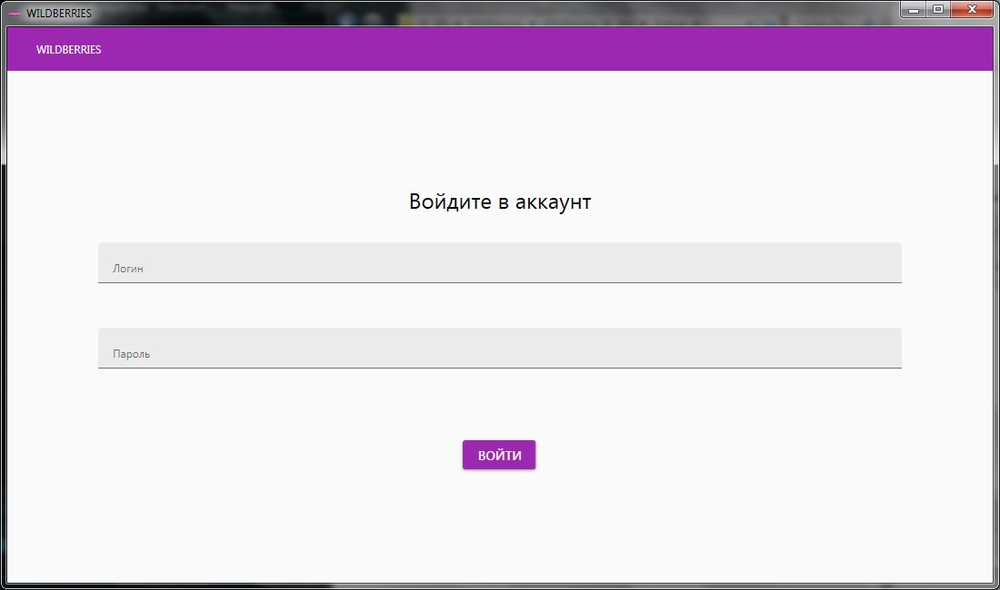
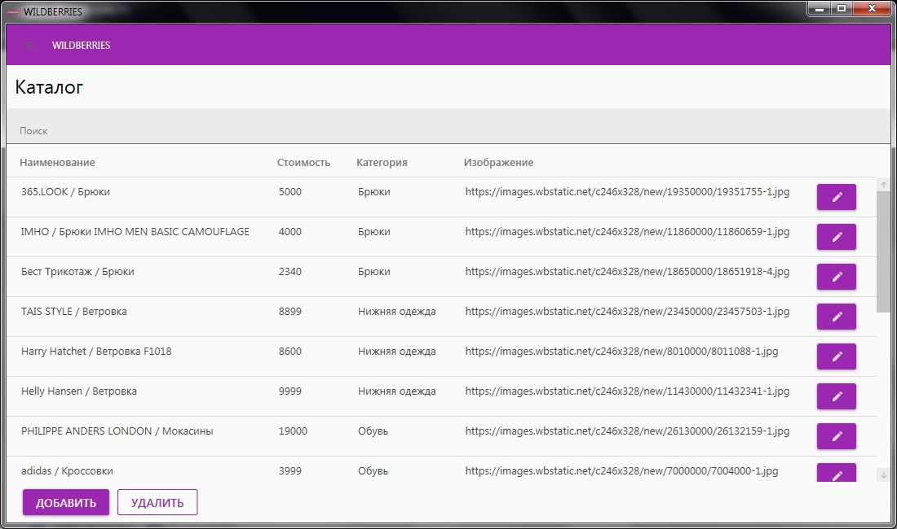

# Интернет магазин "Wildberries"

Информационная система ООО «Wildberries» – это система, которая позволит автоматизировать работу сотрудников предприятия. Система предусматрививает ведение каталога товаров.
При авторизации в приложении пользователь получиает роль с определенным набором прав:
* Администратор – имеет доступ к правке товаров, клиентов и заказов.
* Директор – имеет доступ к правке товаров, клиентов, заказов и иметь доступ к просмотру финансовой статистики предприятия.

## Изображения

